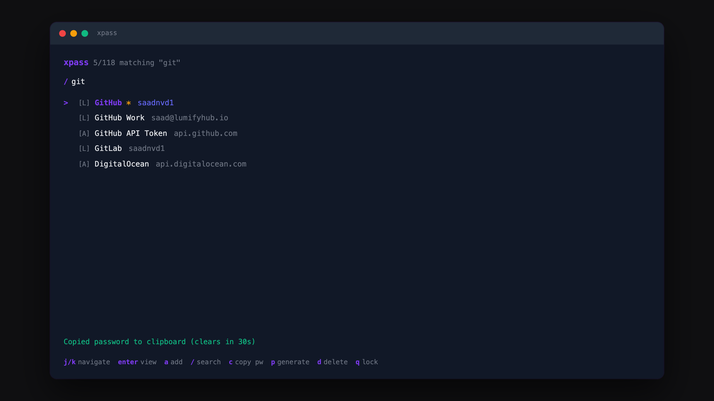

# xpass

> Terminal password manager that replaces 1Password with a single binary

<p align="center">
	
</p>

## Features

- **AES-256-GCM** encryption with PBKDF2-SHA256 (600k iterations)
- **Bubble Tea TUI** with vim-style navigation and real-time search
- **1Password import** from .1pux, .csv, and .json exports
- **Git sync** across machines using a private repo
- **Live TOTP** codes with countdown timer + QR code scanning
- **Clipboard** auto-clears after 30 seconds
- **Single binary** — no runtime, no daemon, no cloud
- Zero third-party crypto dependencies

## Install

```sh
git clone https://github.com/saadnvd1/xpass.git && cd xpass && make install
```

Or with Go:

```sh
go install github.com/saadnvd1/xpass@latest
```

## Usage

```sh
# Create vault and launch TUI
xpass init
xpass
```

### CLI

```sh
xpass get github --copy       # copy password (auto-clears 30s)
xpass add github -u user -p pass --url github.com
xpass list                    # list all entries
xpass gen --copy              # generate and copy password
xpass import export.1pux      # import from 1Password
xpass scan qr.png             # scan QR code to add TOTP
xpass scan qr.png -e github   # add TOTP to existing entry
```

### Multi-device sync

Sync your vault across machines using a private git repo. Only encrypted files are pushed — useless without your master password.

#### First machine (setup)

```sh
# Create a private repo for your vault (once)
gh repo create my-vault --private

xpass remote git@github.com:you/my-vault.git
xpass push
```

#### New machine

```sh
# Install xpass
git clone https://github.com/saadnvd1/xpass.git && cd xpass && make install

# Init with the SAME master password
xpass init

# Connect and pull
xpass remote git@github.com:you/my-vault.git
xpass pull
```

That's it. Same password on both machines derives the same key. No key file to copy.

#### Day-to-day

```sh
xpass push         # after making changes
xpass pull         # before working on another machine
xpass sync         # check if ahead/behind
```

Changes auto-commit locally after every add/edit/delete. Just remember to push.

### TUI keybindings

| Key | Action |
|-----|--------|
| `j` / `k` | Navigate |
| `enter` | View entry |
| `/` | Search (real-time) |
| `a` | Add login |
| `1` `2` `3` `4` | Add login / API key / SSH key / note |
| `c` | Copy password |
| `s` | Show/hide secrets |
| `u` | Copy username |
| `t` | Copy TOTP code |
| `e` | Edit |
| `d` | Delete |
| `f` | Favorite |
| `p` | Password generator |
| `q` | Lock |

## How it works

Master password → PBKDF2-SHA256 (600k iterations + random salt) → 256-bit key → AES-256-GCM. Vault files at `~/.xpass/` contain only encrypted JSON. Wrong password = GCM auth tag failure. No password hash stored anywhere.

Every mutation auto-commits to a local git repo. `push`/`pull` sync the encrypted files through any git remote.

## FAQ

#### What happens if I forget my master password?

Your vault is gone. The password is never stored — it's derived into a key at unlock time and discarded on lock. There is no recovery.

#### Is it safe to push the vault to GitHub?

Yes. The files are AES-256-GCM ciphertext with a 600k-iteration PBKDF2 derived key. A private repo adds defense in depth, but the encryption stands on its own.

#### Can I import from other password managers?

1Password is fully supported (.1pux, .csv, .json). Other managers that export to CSV can likely be imported with minor format adjustments.

#### Why not just use KeePass / Bitwarden / pass?

KeePass UX is stuck in 2005. Bitwarden requires a server or trusting their cloud. `pass` requires GPG. xpass is one binary, one password, AES-256-GCM, done.

## Related

- [tokenvault](https://github.com/saadnvd1/tokenvault) - Encrypted API token store with git sync

## License

MIT
